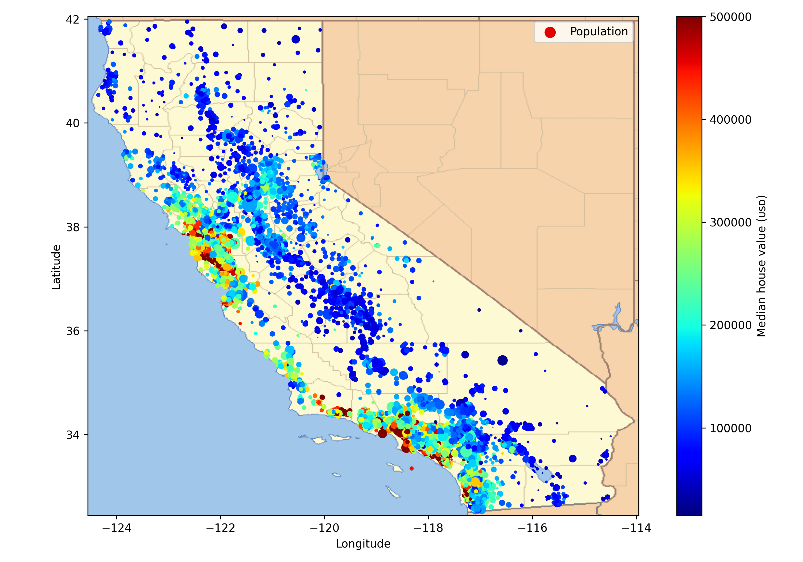
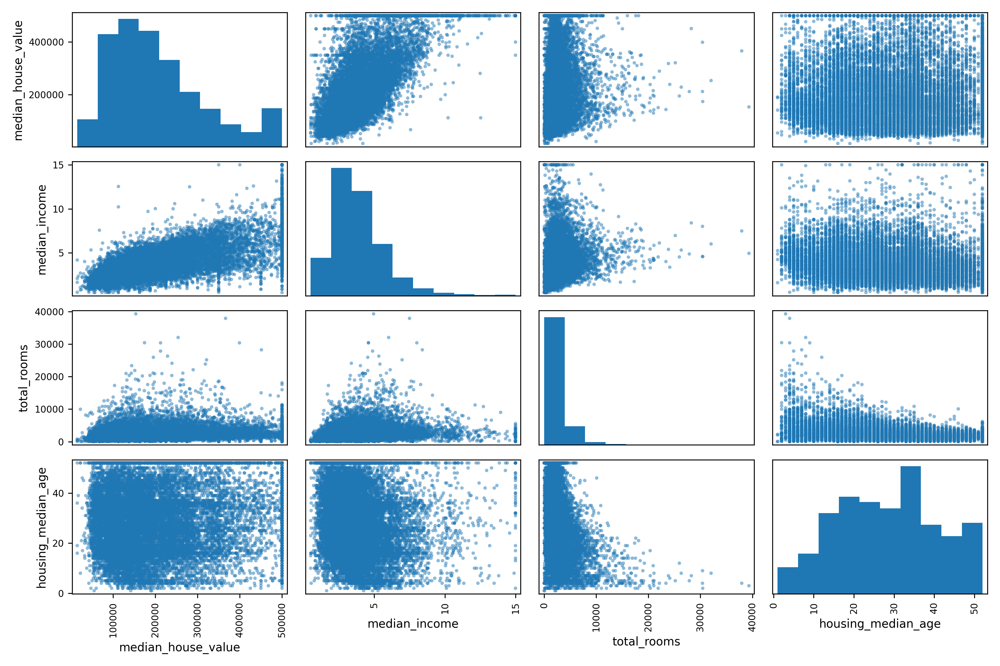
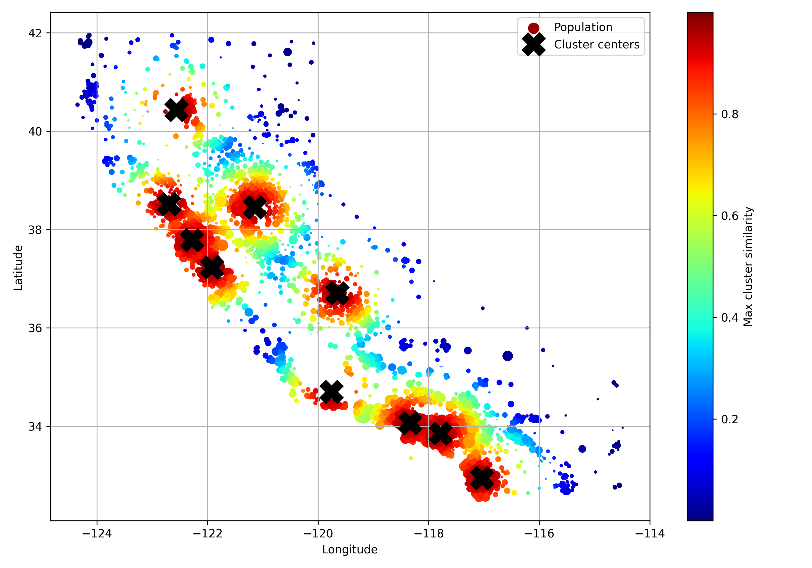
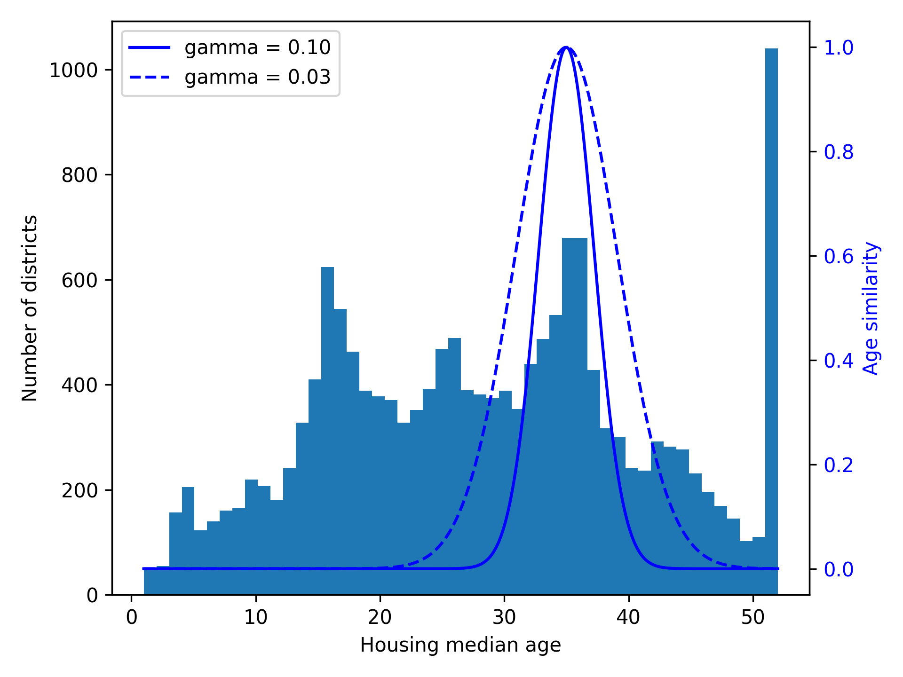

# 🏠 Chapter 2 — End-to-End Machine Learning Project

### 📚 Overview
This chapter applies the full ML process to a **California housing price prediction** project.  
It covers data exploration, feature engineering, transformations, pipelines, and model evaluation.  
By the end, you’ll have a complete predictive model and a reproducible workflow.

---

### 🧩 Key Topics
- Problem framing and data understanding  
- Handling missing values and outliers  
- Feature scaling and transformation  
- Pipelines and preprocessing steps  
- Model training, validation, and fine-tuning  
- Cross-validation and grid search  

---

### 🧮 Notebook Highlights
- Full end-to-end ML pipeline with Scikit-Learn  
- Feature engineering (log transformations, bins, custom transformers)  
- Model evaluation using RMSE, MAE, and cross-validation  
- Reproducibility through pipeline encapsulation  

---

### 📓 Notebook
[Open Notebook](https://github.com/umbutun/real-estate-price-predictor/blob/main/notebook/real_estate_price_predictor.ipynb)

---

### 📊 Preview

  

*Figure 1: Distribution of Median Housing Prices and Population on California Map*

  

*Figure 2: Analyzing Correlation of Numeric Features With Scatter Matrix Plot*

  

*Figure 3: Using K-Means Clustering to Find Cluster Centers and Measuring Geographic Similarity to Cluster Centroids*

  

*Figure 4: Gaussian RBF Measuring the Similarity Between the Housing Median Age and 35*

---

### ⚙️ Dependencies
- Python 3.10+  
- NumPy, Pandas, Scikit-Learn  
- Matplotlib, Seaborn  
- Joblib, TQDM  

---

### 🔗 Resources
- [Hands-On Machine Learning with Scikit-Learn and PyTorch](https://www.oreilly.com/library/view/hands-on-machine-learning/9798341607972/)
- [Project Repository](https://github.com/umbutun/real-estate-price-predictor)  

---

> _“An ML project is a story of data — how you prepare it, understand it, and make it predict.”_
