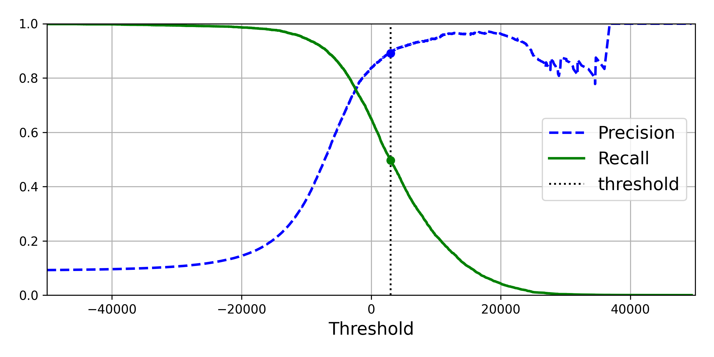
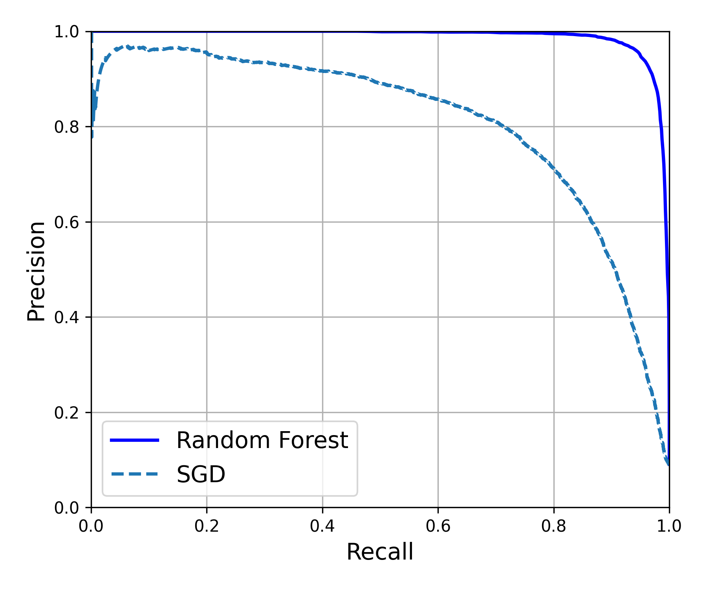
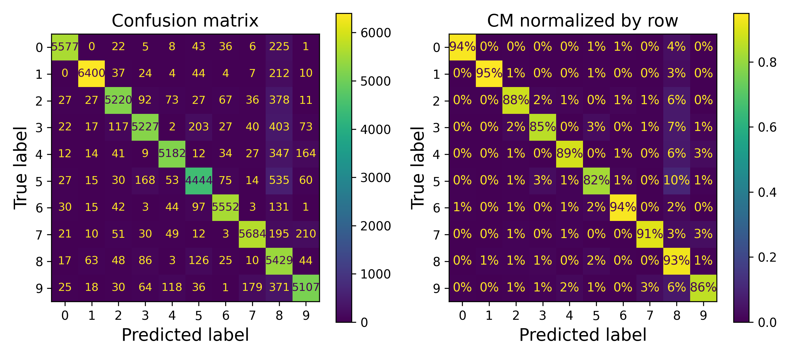

# 🏛️ Chapter 03: Classification

### 📚 Overview
In this chapter, we explore various classification algorithms and their applications in machine learning. We discuss how to choose the right classification model for your data and evaluate its performance.

---

### ⚿ Key Topics
- Introduction to Classification
- Logistic Regression
- Decision Trees
- Random Forests
- Support Vector Machines
- Model Evaluation Metrics

---

### ⚡️ Notebook Highlights
- Practical implementation of classification algorithms using Python.
- Hands-on examples that illustrate the strengths and weaknesses of each algorithm.
- Visualizations to understand algorithm performance.

---

### 📓 Notebook
[Open Notebook](./chapter_03_notebook.ipynb)

---

### 📊 Preview

  

*Figure 1: Precision and Recall at a Certain Threshold*

  

*Figure 2: Comparing Two Models With Drawing Precision vs. Recall*

  

*Figure 3: Confusion Matrix and Normalized CM Displaying Predicted vs. Actual Label*

---

### ⛓️ Dependencies
- Python 3.x
- scikit-learn
- pandas
- matplotlib
- seaborn

---

### ㈾ Resources
- [Hands-On Machine Learning with Scikit-Learn, Keras, and TensorFlow](https://www.oreilly.com/library/view/hands-on-machine-learning/9781492032632/)
- [Scikit-learn Documentation](https://scikit-learn.org/stable/documentation.html)

---

> _"The goal is to turn data into information, and information into insight."_
> — Carly Fiorina
