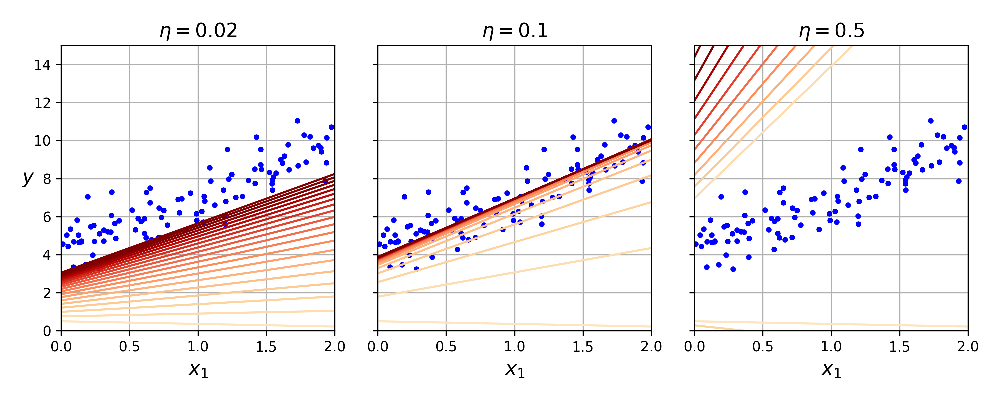
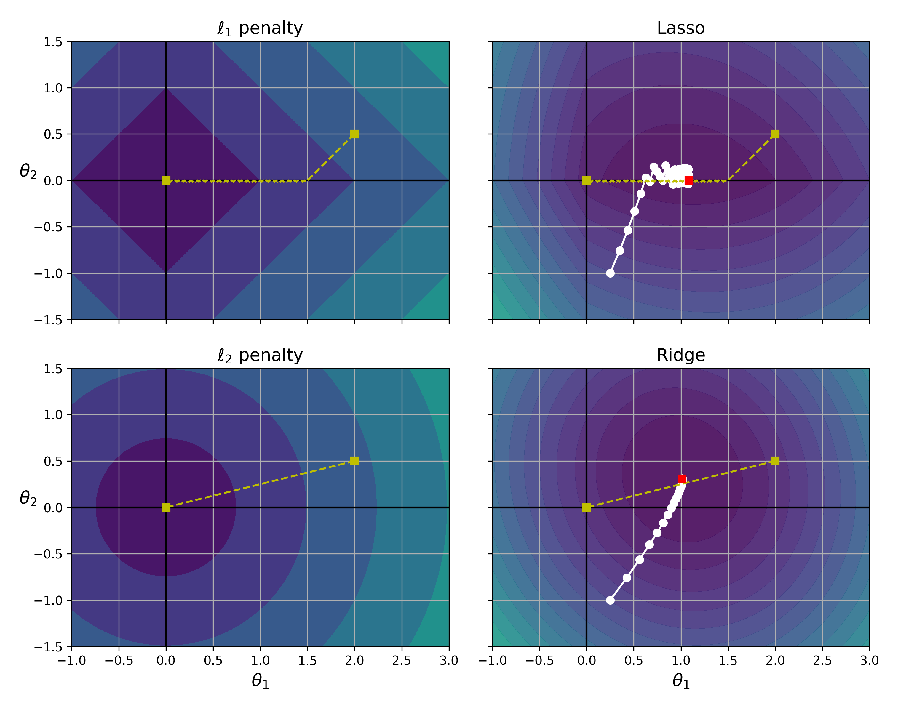
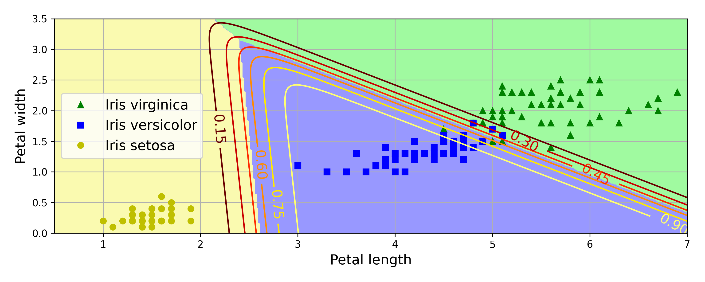

# 📘 Chapter 4 — Training Models

### 🧭 Overview
This notebook explores the **core algorithms** behind linear and polynomial regression, focusing on how optimization and regularization influence model performance.  
You’ll experiment with gradient descent variants and visualize how models learn over time.

---

### 🗝️ Key Topics
- Linear and polynomial regression  
- Batch, stochastic, and mini-batch gradient descent  
- Learning-rate tuning and feature scaling  
- Regularization: Ridge, Lasso, Elastic Net  
- Early stopping for overfitting control  

---

### 💡 Notebook Highlights
- Implemented regression models from scratch  
- Compared learning behaviors of different optimizers  
- Demonstrated impact of regularization on bias–variance trade-off  
- Visualized cost-function convergence and learning curves  
---

### 🔗 Quick Links

- 📓 **Open Chapter Notebook:**  
  [Open Notebook](./chapter_04_notebook.ipynb)

- ☁️ **Open in Google Colab:**  
  

- 📚 **Back to Hands-On-Machine-Learning-Practice Collection:** 
  [⬅ Back to Main Collection](https://github.com/umbutun/hands-on-machine-learning-practice)
  
---

### 📊 Preview

  

*Figure 1: Gradient Descent With Different Learning Rates*

  

*Figure 2: Learning Curves Plot for an Overfitting Example*

  

*Figure 3: Lasso and Ridge Regularization Cost Function*

  

*Figure 4: Softmax Regression ContourPlot Displaying Decision Boundaries, Corresponding Probabilities and Multinomial Classification*

---

### ⚙️ Dependencies
- Python ≥ 3.10  
- NumPy • Pandas • Matplotlib • Scikit-Learn  
- Jupyter Notebook  

---

### 📚 Resources
- [Hands-On Machine Learning with Scikit-Learn and PyTorch](https://www.oreilly.com/library/view/hands-on-machine-learning/9798341607972/)
- [Scikit-Learn Linear Models Documentation](https://scikit-learn.org/stable/modules/linear_model.html)  
- [Gradient Descent Algorithm Explained – Towards Data Science](https://towardsdatascience.com/gradient-descent-algorithm-and-its-variants-10f652806a3)  

---

> _“A model that generalizes well learns patterns, not noise.”_  — Aurélien Géron
